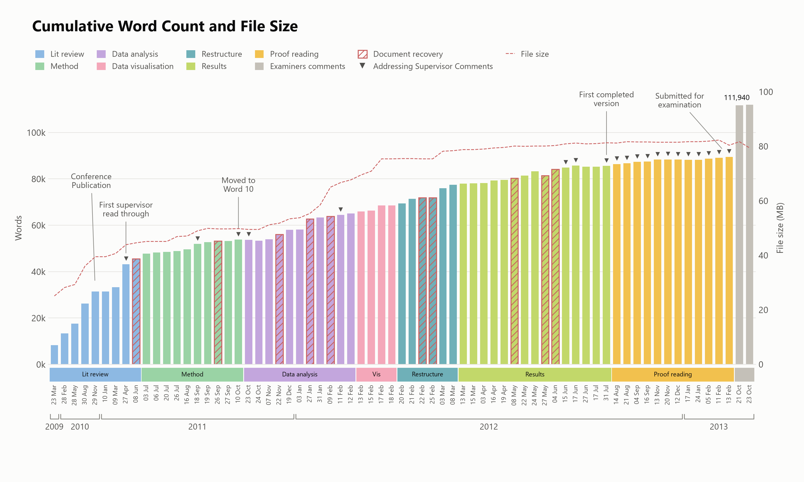
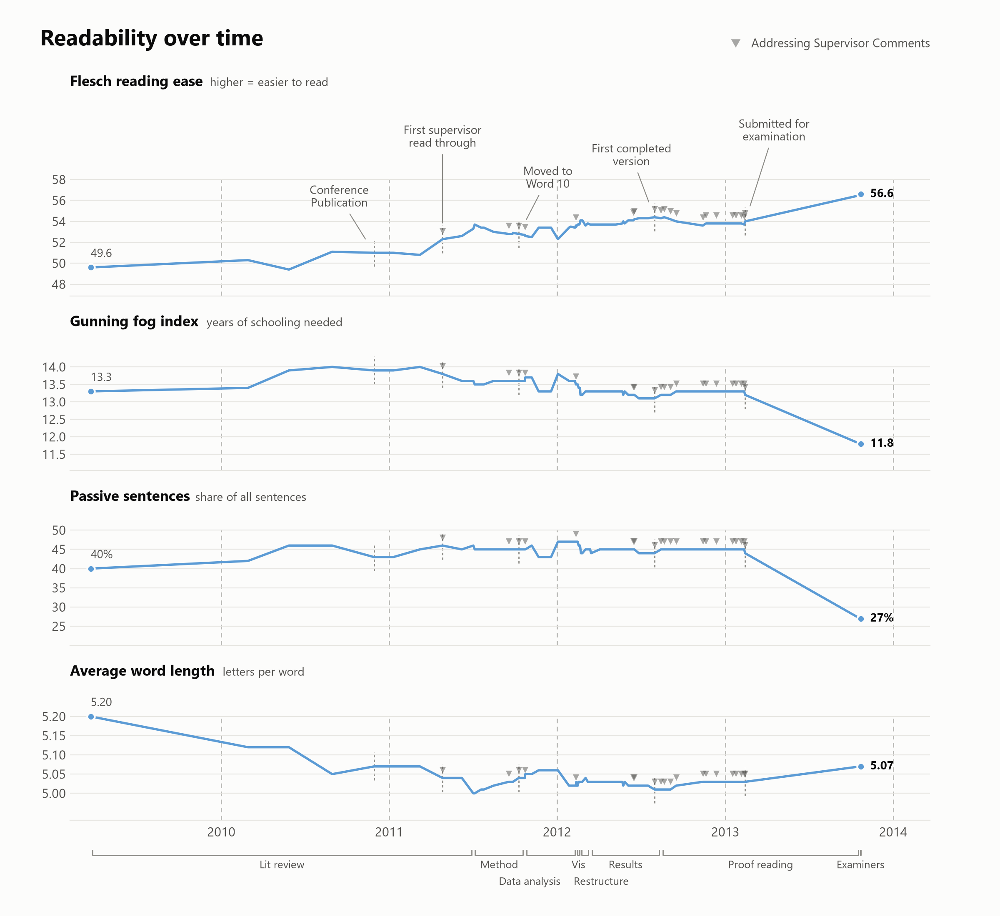

# PhD-MetaData
A review of my thesis (Creemers, 2013) size and writing quality metrics against time. 

Motivation:  
I liked [this post](https://www.reddit.com/r/dataisbeautiful/comments/7fdl2f/how_i_wrote_my_masters_thesis_oc/) on Reddit, so I thought 
I would try it myself. Pushed docx2txt output through "GNU style", then through a regex. Got some good meta-data.

Notes:
  - I had not planned to do this, so the data points are irregular. The data was gathered from 79 available backups in my Dropbox.
  - This PhD was conducted part-time, while I worked full-time. That is a terrible way to do a PhD, but life threw me a curveball, and I got there eventually.
  - I made the document in Word (not a wise choice in hindsight), and that involved 10 cases of the document becoming corrupted and needing to be recovered.
  - I don't have the early backups of the work, so it starts at 8k words. However, I think it's fair to say the document prior to 2009 was mostly rewritten.
  - The cumulative chart shows when I had to advance the file save, so it's indicative of how busy/productive I was in that year.


## Graphs





### Regenerating

```sh
python -m venv .venv
.venv\Scripts\activate        # Windows (source .venv/bin/activate elsewhere)
pip install -r requirements.txt
python make_graphs.py
```

Writes PNGs to `graphs/`.

  

References:  
  - Creemers, W. (2013). On the Recognition of Emotion from Physiological Data. Retrieved from http://ro.ecu.edu.au/theses/680
